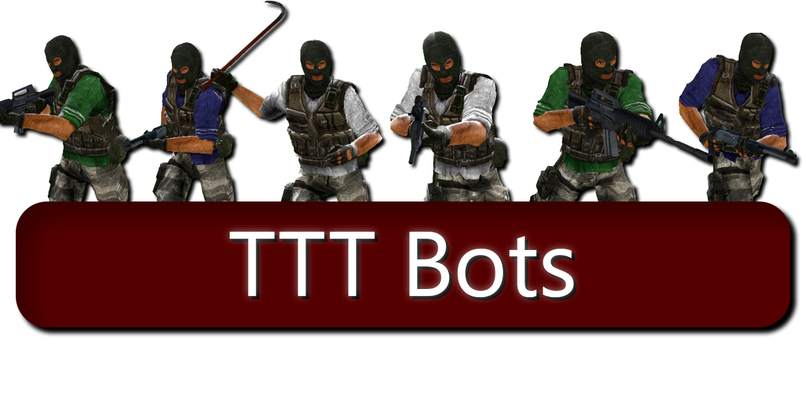

  

Please leave any bug reports or feature requests in the Issues section. THANK YOU to all the bug reporters that have helped me improve this project!



## What is this?

This is a player bot addon for the Trouble in Terrorist Town game mode in Garry's Mod.

It is designed to be as modular as possible, allowing easy customization and expansion. It is designed for TTT2 while being fully playable in regular TTT.

📝 Note: Please stick to the main branch. Most other branches are eitherunstable or significantly behind.

## Maps

You can find the maps custom-made for this add-on [here](https://www.github.com/thebigsleepjoe/TTT-Bots-2-Maps).

**The bots will work on any map with a navmesh**, but if you want plug-and-play and/or you don't care, you can just use the above add-on.

## How to use

1. Download the latest version from the [Steam Workshop](https://steamcommunity.com/sharedfiles/filedetails/?id=1256344426).
2. Start a Peer-to-Peer or SRCDS with sufficient player slots on a map with a navmesh or one of the included maps.
3. *As a super admin,* either type `!botadd X` in chat or write `ttt_bot_add X` in the console.
4. You're done!

## Role Support

This add-on supports a wide range of TTT2 roles. Here are some that have explicit compatibility:

* Jester
* Jackal
* Sidekick
* Hitman
* Serial Killer
* Survivalist
* Bodyguard
* Sheriff
* Deputy
* Drunk
* Shinigami
* Amnesiac
* Swapper
* Arsonist
* Brainwasher
* Defector
* Executioner
* Hidden
* Shanker
* Loot Goblin
* Occultist
* Paranoid
* Revolutionary
* Spy
* Psychopath
* Bandit
* Gambler
* Doctor
* Roider
* Fuse
* Mesmerist
* Thrall
* Beggar
* Collusionist
* Blocker
* Cursed
* Revenant
* Pharaoh
* Graverobber

The mod also auto-generates compatibility with custom roles, but it is imperfect. It does not comprehend most 'public killer' roles (e.g., 'Speedrunner').

## Usage and Commands

A basic usage guide can be found [on the wiki](https://github.com/thebigsleepjoe/TTT-Bots-2/wiki/Basic-Usage-Guide).

It will give you all the info you need for 90% of cases. A more in-depth set of guides are a WIP.

### Grenades and Super Soda

Bots throw the grenades they are carrying (`ttt_bot_throw_nades`, on by default). A TTT2 grenade is not a
click-to-shoot weapon: the first press pulls the pin and the *release* does the throwing — hold it and the
fuse runs out in your own hands — so a bot makes the same gesture a player does, and only when it has a
reason to:

Bots only throw at an enemy they know about but have **lost sight of** — the case where a gun cannot reach
and a grenade can. A damaging grenade (incendiary, or anything unrecognised) additionally requires that no
teammate is standing close enough to the spot to be caught by it; smoke and the discombobulator just need the
enemy to be far enough that the smoke is worth it.

The three TTT2 grenades are buyable too, as a side purchase below any weapon: smoke for the innocent side,
the incendiary and discombobulator for the traitors, each gated on a matching personality so a round does not
turn into everyone lobbing fire.

When the server runs [Super Soda](https://github.com/TTT-2/ttt2-super-soda), bots walk to the cans and drink
them (`ttt_bot_use_soda`, on by default): health while hurt, then armour and the combat buffs otherwise. That
addon hands its cans out on a `+use` keypress, which a bot can never send, so the bot calls the addon's own
pickup instead — the same checks (range, the one-per-player limit, single-use cans) run either way.

A traitor bot carrying the [Fake Soda](https://github.com/mexikoedi/ttt2_fake_soda) decoy uses it where a can
belongs: on the exact spot it just drank a real can from, or beside
a real can that is still standing. That addon's weapon defaults to *throwing* the can and only places it after
a reload toggles the mode, so the bot toggles it, walks within reach of the chosen spot, looks at it and
places one. A decoy alone in the middle of nowhere convinces nobody. It buys the item only while the map
actually has a can to sit it beside.

A traitor carrying the [Boom Body](https://github.com/TTT-2/ttt2-wep_boom_body) uses it early in the round.
That weapon builds a fake corpse of a *random* player wherever the
addon decides to put it and then removes itself, so there is nothing for a bot to aim at — the trap is the
body, and it goes off on whoever searches it. The bot does know better than to search its own.

The [Thomas the Tank Engine](https://github.com/adigram/ttt_adithomas) gun is the opposite case: the weapon
chooses nothing and the *aim* is the whole decision, so a bot fires it at a remembered enemy.
The train drives through walls for fifteen seconds before exploding,
so it will not fire one at a target standing next to it — the blast would take the bot with it — and it will
not fire one down a line a teammate is standing on, because the train kills whoever it touches.

The [Minethrower](https://github.com/mexikoedi/ttt_ttt2_minethrower) is the one item both sides can buy: a bot
throws a combine mine at a remembered enemy, or, with nothing to
throw at, leaves one in a doorway it is standing in and then walks well clear of it — a hopper mine does not
care whose mine it is.

Four of those items - the decoy can, the Boom Body, the train gun and the Minethrower - have no switch of their
own, and that is deliberate: they are side purchases, so the buyable list is the switch. Remove the entry in
`lua/tttbots2/data/sv_buyables_expanded.lua` and bots will not buy it. (A bot that loots one from a body still
uses it, because there is nothing left to tell it not to.) Super Soda keeps its `ttt_bot_use_soda` because cans
are map furniture rather than something a bot pays for.

| Cvar | Default | What it does |
| --- | --- | --- |
| `ttt_bot_throw_nades` | `1` | Allows bots to throw a grenade they are carrying. |
| `ttt_bot_use_soda` | `1` | Allows bots to drink Super Soda cans. A no-op without that addon. |

## For developers

[Check out the developer guide](https://github.com/thebigsleepjoe/TTT-Bots-2/wiki/Developer-Guide).

### Adding custom shop purchases

Bots buy from the same shops players do. To teach them a new item, add an entry to
`lua/tttbots2/data/sv_buyables_expanded.lua` — that file is the default home for extra purchases, and it
is kept separate from `data/sv_default_buyables.lua` so the base game's shop stays easy to diff.

Each entry needs a `Name`, a `Class`, a `Price` in credits (bots spend the same starting credits the
gamemode gives a player of their role) and
a `Priority`. `Roles` lists the role strings that may buy it, and `Teams` lists the teams — the latter is
what lets a custom role inherit its team's shop instead of being named in every entry. `CanBuy` can veto
the purchase for a given bot, and `ShortRange` marks weapons that only work at knife range (the bots will
close in before holding one).

`PrimaryWeapon` makes the bot treat the item as a weapon to hold. That is all the bookkeeping an entry needs:
everything in the expanded file is a *custom* buyable, and a bot buys at most one custom item per round,
picked at random from the ones it can afford — so a new weapon competes with the rest of the file just by
existing, and a pack of weapons spreads across a round instead of every bot buying whichever entry the
priority sort put first. `RandomChance` works as "considered this round", which is how an item stays rare.
Two optional fields cover the rest: `Group`, to draw from a specific set of entries instead of the whole
custom shop, and `Tier = "base"`, to have an item bought like a base game item rather than joining the draw.
Perks (TTT2's passive items, under `lua/terrortown/entities/items`) need a `BuyFunc` that calls
`Player:GiveItem`, since that is what runs the item's own `Bought` hook — see the Martyrdom entry for a
worked example. The header of the expanded file documents every field.

### Role-exclusive weapons

A weapon that only one role is ever handed — the Arsonist's thrower, the Shanker's knife — is proof of that
role, so the bots treat seeing one as a KOS callout. Declare yours in your role file:

```lua
myRole:SetRoleWeapons({ "weapon_my_role_knife" })
```

Only do this for weapons nobody else can obtain. **Shop weapons are not role weapons** and are not a tell at
all: a role can borrow another team's shop, the same weapon is often sold to more than one team, and anyone
can loot a corpse, so a bot carrying one proves nothing about its role.

### Role behaviour flags

Some roles are only dangerous, or only useful, in one particular way, and the bots read that from the role
data instead of needing a behavior written for them:

* `myRole:SetAutoSwitch(false)` together with `myRole:SetPreferredWeapon("weapon_zm_improvised")` keeps one
  weapon in the bot's hands. This is for a role whose own addon zeroes every point of damage it deals with
  anything else — the Roider's crowbar.
* `myRole:SetDealsNoDamage(true)` stops the bot from ever taking a target. This is for neutral roles that
  cannot hurt anybody and are meant to change sides by looting a dropped shop weapon — the Beggar and the
  Collusionist.
* `myRole:SetRevivesAnyCorpse(true)` tells the Defib behavior that *any* body is worth a charge rather than
  only a teammate's — the Mesmerist, whose revives come back as Thralls, and the Doctor, whose innocent
  team declares no allies at all.
* `myRole:SetBlocksCorpseIdentify(true)` marks a role that hides the dead from everybody else while one of
  it is alive — the Blocker. Other bots then stop walking towards bodies to identify them; they would
  otherwise read a body through a call that sits below the hook such a role installs, and would keep
  re-targeting the same bodies because they never become found.

Please help me document/improve the codebase! I would highly appreciate it. And you can have bots get named after you!

## License

First and foremost, this open-source software is provided as-is, with no warranty or guarantee of functionality.

I am committed to keeping this project open-source and easily accessible to everyone. I want developers and bot enthusiasts to be able to examine my code, offer feedback, and contribute. However, I have invested much time and effort into developing this project to its current state. Therefore, I have licensed it under CC-BY-SA 4.0, which allows you to clone, use, modify, and redistribute my content freely as long as you give me credit upon using significant portions of my code.

^ You can find the proper legalese for the CC-BY-SA-4.0 license in the LICENSE.txt file.
